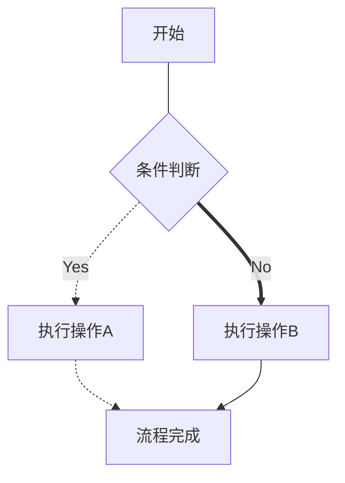

# MarkDown中一些常用的语法

## 段落标识

### 标题

在md文件中在一行起始处使用#表示该行为标题。#号越多，标题级别越低。

### 图片

使用形如

- ![the text of hover]\(path/to/picture)或
- \

的方式书写，表明该行是一张图片，其中，“the description of picture”是您在因为某些原因导致浏览者无法加载出图片时，想要显示的有关图片内容的描述,同时，朗读页面的无障碍服务在朗读图片时，朗读内容也为该描述文本。而“title”则是浏览者鼠标悬停在图片上时出现的提示性文字。图片可以嵌入文本段落中。

调整图片位置和大小一般通过html语法。所以建议图片使用第二种方式进行摆放。当您想要调整图片的宽和高，在标签中添加关键字`width = `和`height = `即可，单位既可以是像素px也可以是相对原始图片大小的百分比比例。eg:\

如果您想要调整图片在水平方向的位置，可以在image元素处为其增加一个容器标签，在头标签中使用关键字`align = `调整图片水平方向位置，可以设置为left,center和right。eg:\<div align = center> \ \</div>

### 引用

在行首使用\>符号表示该段落为引用内容。值得强调的是，在引用内容中使用Enter键，新行的内容仍然属于引用内容，您需要与引用内容保持至少一个空白行，才不会被视作引用内容。因为md中要求，间隔一个空白行的文本才被视作不同段落的内容。

### 列表

列表可以分为有序列表和无序列表，有序列表项在行首使用阿拉伯数字(具体语法为number\space，\space意为您需要在数字后跟一个空格，以区分列表项头和列表项文本)进行标识，表明该段落为一个有序列表项。
eg:渲染前1. 示例文本1 2. 示例文本2 3.示例文本3
渲染后
1. 示例文本1
2. 示例文本2
3. 示例文本3

您可以注意到，列表项相对普通段落进行了缩进，这种缩进关系最多可以有三级，想要使用更低级别的列表项，在已有列表项中继续写列表项即可，注意需要使用两个空格或一个制表符对低级列表项头进行缩进。eg:渲染前 1. 示例文本1 1.示例文本11 2.示例文本2 2.示例文本21 3.示例文本3
渲染后

1. 示例文本1
   1. 示例文本11
2. 示例文本2
   1. 示例文本21
3. 示例文本3

至于无序列表，则在行首使用\-或\*表明该段落为无序列表项，除没有使用明显序号的列表项头外，其余同有序列表。eg：渲染前 \- 示例文本1 \- 示例文本11 \- 示例文本2
渲染后

- 示例文本1
  - 示例文本11
- 示例文本2

### 表格

表格的书写可以分为三个部分，由上到下依次是表头，格式，单元格。表头占一行，不同列的表头间用\|隔开，首列左侧和尾列右侧可以不加\|。eg:表头1\|表头2\|表头3

表头下方是格式行，占一行，使用-和:控制该列单元格的分布格式，分别是:-左对齐，-:右对齐和:-:居中,不同列格式用|隔开。eg: :-:\|:-:\|:-:

最后是单元格，每行表示表格中的一行单元格，不同单元格内容用|隔开。eg: 文本1\|文本2\|文本3

渲染后的效果如下

列1|列2|列3
:-:|:-:|:-:
文本1|文本2|文本3

### 代码块

使用一对三撇号```可以表示其中的内容按代码块格式渲染，不同渲染引擎效果不同，在前一个三撇号后可以增加文本用以说明代码块使用的语言。eg:\`\`\` plaintext

渲染后：
```plaintext
这是一段普通文本
```

## 文本标识

### 斜体、加粗、下划线、涂抹与高亮

- 您可以使用一对星号\*表明其中内容应被渲染为斜体，一般斜体在英语环境中用来表示书籍、文献的标题等。eg:渲染前 \*示例文本\* 渲染后 *示例文本*
- 您可以使用一对双星号\*\*表示其中内容应被加粗渲染。eg:渲染前 \*\*示例文本\*\* 渲染后 **示例文本**
- 您可以使用html标签\<u>\</u>来表明其中内容应该被渲染出下划线。eg:渲染前 \<u>示例文本\</u> 渲染后 <u>示例文本</u>
- 您可以使用一对撇号\`表明其中内容应被渲染为涂抹(灰色背景色)状态。eg:渲染前 \`示例文本\` 渲染后 `示例文本`

### 上下标和注解

使用一对`^`包含的文本会被渲染为前一文本的上标，使用一对`~`包含的文本会被渲染为前一文本的下标，使用`^[]`，会为前一文本增加上标，并提供注释文本链接，点击上标即可快速跳转到注解，点击注解末尾的回车符可以快速跳转到注解文本处。

Jekyll不支持渲染此类md语法。

## 数学公式

Markdown一大好处是它可以以轻量方式书写Latex公式。不同渲染器语法可能存在不同，此处小编仅给出尽量通用的写法。

行内数学公式区域用一对`$`标出，独行数学公式仅用一对`$$`标出。eg:渲染前 `$y=x+1$`，渲染后 $y=x+1$

渲染前:`$$y=x+1 y=x^2$$`

渲染后：
$$
y=x+1 \space \space \space y=x^2
$$

### 多行数学公式渲染

Jekyll不支持多行数学公式渲染。

这需要借用Latex语法，我们使用一对`$$`表明将在区域内进行Latex公式的书写，再使用`\begin{align}`与`\end{aligh}`说明将在区域内进行多行公式的书写。

使用`\\`表示每行的结束，`&`表示该行本列的结束，最后一行无需再使用`\\`。

渲染前：\$\$<br>\begin{align}<br>y=&x+1\\\\<br>y-x=&1
\end{align}<br>\$\$

渲染后：
$$
\begin{align}
   y=&x+1\\y-x=&1
\end{align}
$$

在每行末尾增加\nonumber可以去除标号。  
$$
\begin{align}
   y=&x+1 \nonumber \\y-x=&1 \nonumber
\end{align}
$$  

当我们想要调整每一列的对齐方式时可以使用`\begin{array}{}`和`\end{array}`，`\begin{array}{}`第二个中括号内选填c、l、r(central,left和right)表示每列对齐方式，可不填，没有指定控制的列默认左对齐，只填入一个字母时表示对所有列应用该对齐方式。行与列划分与`align`相同。

   $$
      \begin{array}{rl}
         x+2x_2+7x_4+5x+3x_3&=x+5x+2x_2+3x_3+7x_4  \\
         &=6x+2x_2+3x_3+7x_4 
      \end{array}
   $$

当我们想要拥有自适应行数的花括号时可以使用`\begin{cases}`和`\end{cases}`,但无法调整各列分布方式，行列划分方法与前两种方法一致

   $$
   f(x)=
      \begin{cases}
         0, & x<0, \\
         p_0, & 0\leq x<1,\\
         1, & 1\leq x, 
      \end{cases}
   $$

上述三种方法都可以在`\begin`前`$$`后，以及`\end`后，`$$`前输入数学公式或汉字，显示效果为在公式左侧或右侧居中。


### 公式美化

使用`\left(`和`\right)`可以调整成对符号大小，使其适合内含物的大小，使得排版更美观，当只想作用于单独一边符号，可以用`\right.`代替`\right`或用`\left.`代替`\left`。效果示例如下

   $$(\frac{1}{x^2+2x+1})$$
   $$\left( \frac{1}{x^2+2x+1}\right )$$

当我们想要在行内公式中，上下标出现在符号正上或正下方时，可以使用\limits置于符号与上下标之间(仅限于部分符号，适用的符号在行间公式渲染时不使用\limits上下标就会被渲染成正上和正下)：$\sum^{n}_{i=1}i \space \space \sum\limits^{n}\limits_{i=1}i$

### 数学符号
- 希腊字母类：
  - \alpha $\alpha$ \Alpha $\Alpha$ A $A$
  - \beta $\beta$ \Beta $\Beta$ B $B$
  - \gamma $\gamma$ \Gamma $\Gamma$
  - \delta $\delta$ \Delta $\Delta$ 
  - \rho $\rho$ \Rho $\Rho$
  - \lambda $\lambda$ \Lambda $\Lambda$
  - \mu $\mu$ \Mu $\Mu$
  - \sigma $\sigma$ \Sigma $\Sigma$
  - \epsilon $\epsilon$ \Epsilon　$\Epsilon$
- 集合论类：
   - 属于 \in $\in$
   - 不属于 \notin $\notin$
   - 包含于 \subseteq $\subseteq$
   - 真包含于 \subset $\subset$
   - 并 \cup $\cup$
   - 交 \cap $\cap$
   - 累并 \bigcup $\bigcup$
   - 累交 \bigcap $\bigcap$
   - 空集 \emptyset $\emptyset$
- 微积分类
   - 一重不定积分号 \int $\int$ 二重不定积分号 \iint $\iint$ 三重不定积分号 \iiint $\iiint$
   - 极限 \lim $\lim$ $lim$
   - 无穷大 \infty $\infty$
   - 导数简写时的一撇 \prime $\prime$ \backprime $\backprime$
- 算术运算符和逻辑运算符类
   - 乘法 叉乘 \times $\times$ 
     点乘 \cdot $\cdot$
   - 除法 \div $\div$
   - 累加 \sum $\sum$
   - 累乘 \prod $\prod$
   - 大于等于 \geq   $\geq$
   - 小于等于 \leq   $\leq$
   - 不等于 \neq $\neq$
   - 等价于 \iff $\iff$
   - 约等于 \approx $\approx$
- 其他
   - 对立事件(字母上方划一横线):\bar{} $\bar{A}$
   - 全称量词 \forall $\forall$
   - 存在量词 \exists $\exists$
   - 上花括号 \overbrace{}^{} $\overbrace{x_1,x_2,\cdots x_n}^{n}$
   - 下花括号 \underbrace{}_{} ，jekyll不支持渲染
   - 省略号:\cdot $\cdot$ \cdots $\cdots$
   - (几何)相似/(变量)服从:\sim(similiar) $\sim$
   - 左箭头\leftarrow  \gets $\leftarrow \space \gets$ 
   - 右箭头rightarrow \to $\rightarrow \to$
   - 上下箭头uparrow $\uparrow$ downarrow $\downarrow$

## 简易绘图

### 流程图(Flowchart)

使用` ```mermaid`声明流程图区域自此开始，独占一行
之后使用`graph graph_toward`,其中`graph`表示绘制流程图，`graph_toward`声明图的朝向，独占一行
  - T(top)B(bottom)表示自顶向下
  - BT表示自下向上
  - LR表示自左向右
  - RL表示自右向左
  
使用大写英文字母表示图中的某个结点，圆括号，方括号，花括号表示结点形状，其包含的内容为结点内容
   - ()圆括号表示圆角矩形
   - []方括号表示矩形
   - {}花括号表示菱形
   - (())两层圆括号表示圆形
   - \> \]表示旗帜形

在表示完图类型和朝向后，描述不同结点间的关系，在流程图中仅有指向一种关系，每行单独说明一对指向，形如A()--B()，分别为结点`A`，结点样式`()`，线段样式`--`，结点`B`，结点样式`()`。
  - 线段样式最后是否有>表示是否有箭头(双实线线段是必须添加>)
  - --表示实线(不带箭头时要用三个短横杠,即---)
  - -.-表示虚线(是否画箭头不影响虚线的表示)
  - ==表示粗实线(必须画箭头,即\==>)

最后以三个撇号```结尾,表示流程图相关的语句已结束 ，示例如下，Jekyll不支持mermaid渲染。


