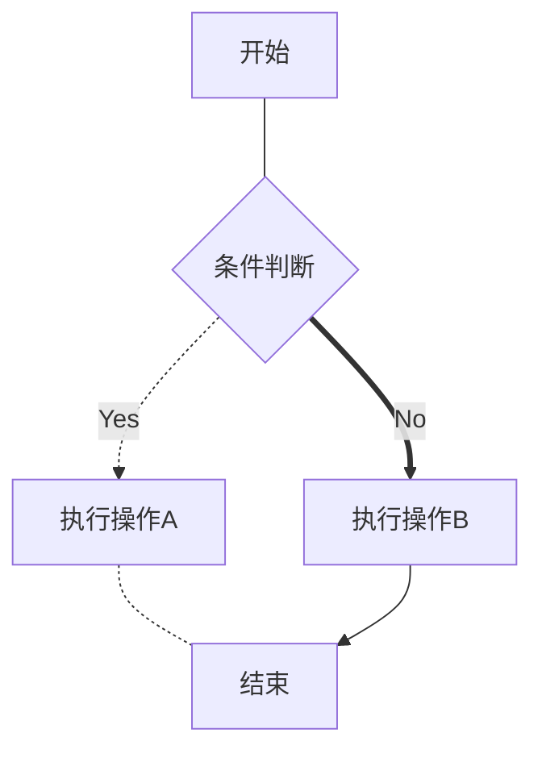

# MarkDown中一些常用的语法
1. 标题
使用'#'来表示这是标题，#号的数量和标题等级递减
2. 斜体、加粗、引用、下划线和涂抹、高亮显示
- 使用一对'*'表示斜体 *斜体*
- 一对'**'表示加粗 **加粗**
- '>'表示此后为引用文本，间隔一行后不再被视作引用内容  
>示例文本 

- 使用html语法中的< u >标签标识下划线 <u> 示例文本</u>
- 一对撇号表示涂抹 `示例文本`
- 一对==标识高亮文本 ==示例文本==
3. 有序列表和无序列表
- 有序列表
  - 使用阿拉伯数字依次标号即可，列表项中的文本应与标识的阿拉伯数字相隔至少一个空格；
  - 有序和无序列表之间可相互嵌套；
  - 当有序列表在某一列表区域内重复出现时，尽管同样用阿拉伯数字编号，但序号表示会自动改变，最多能使三层有序列表标号不重复；
  - 只能使用阿拉伯数字标识此处文本为列表的一部分，即使使用会自动替换重复出现的阿拉伯数字标号的字母也不会被视作是列表的一部分
- 无序列表
  - 使用短横线或星号表示此处文本为列表的一部分，空行后的文本不被视作是当前列表层级的文本；
  - 当无序列表在某一列表区域重复出现时，尽管同样用'-'和'*'标识列表，但列表中文本前的表示符号也会自动改变，最多用三种不同的符号标识不同层级的无序列表；
  - 只能使用'-'或'*'来标识无序列表，即使使用markdown文件的显示页面中所用的表示符号也不会被视作时列表的一部分
4. 表格
   1. 表头使用|分隔不同单元格，在|中书写表头内容,表格最左侧和最右侧竖线不影响表格显示，可不写；
   2. 单元格文本位置格式:使用'-'代表单元格内容；':'表示分布方式，仅在左侧表示左对齐，仅在右侧表示右对齐，左右两侧都有表示居中对齐；'|'用来分隔不同单元格，同样，表格最左侧和最右侧的|不影响显示，省略不写；
   3. 单元格文本：使用|分隔不同单元格，|间为单元格内容 
2. 代码块 
   - 使用一对```标识代码块内容，前一个三撇号后跟语言种类
   - 使用一对`标识行内代码内容，无需写出语言种类
3. 数学公式 使用$LaTex$语法撰写公式内容
   - 行内公式使用一对'$'标识
   - 单行公式使用一对'$$'标识公式内容
   - 想要表示具有多行多列的数学公式，仅需要对齐需求时可以在$ $或$$ $$中使用\begin{align}和\end{align}，每一行用\\\表示结束，用&表示新开一列，最后一行可以不添加反斜杠,\nonumber可以去除本行行号，灵活使用可以满足对行号的需求。示例如下：
   $$
      化简多项式=
      \begin{align}
         x+2x_2+7x_4+5x+3x_3&=x+5x+2x_2+3x_3+7x_4 \nonumber\\
          &=6x+2x_2+3x_3+7x_4 \nonumber
      \end{align}
   $$
   当我们想要调整每一列的对齐方式时可以使用\begin{array}{}和\end{array}，\begin{cases}{}处第二个中括号内选填c、l、r(central,left和right)表示每列对齐方式，可不填，只填入一个字母时表示对所有列应用该对齐方式，填入列数个字母控制每一列的对齐方式；每一行用\\\表示结束，用&表示新开一列，最后一行可以不添加反斜杠，无行号。示例如下：
   $$
      化简多项式=
      \begin{array}{rlr}
         x+2x_2+7x_4+5x+3x_3&=x+5x+2x_2+3x_3+7x_4  \\
         &=6x+2x_2+3x_3+7x_4 
      \end{array}
   $$
   当我们想要拥有自适应行数的花括号时可以使用\begin{cases}和\end{cases},行列划分方法与上述一致
   $$
   f(x)=
      \begin{cases}
         0, & x<0, \\
         p_0, & 0\leq x<1,\\
         1, & 1\leq x, 
      \end{cases}
   $$
   上述三种方法都可以在\begin前输入数学公式或汉字，显示效果如上 
   - 使用\left(和\right)可以调整成对符号大小，使其适合内含物的大小，使得排版更美观，当只想表示单一符号时，可以用\right.代替\right或用\left.代替\left，两者可以同时使用。示例如下
   $$(\frac{1}{x^2+2x+1})$$
   $$\left( \frac{1}{x^2+2x+1}\right )$$
   $$\left( \frac{1}{x^2+2x+1}\right.$$
   $$\left. \frac{1}{x^2+2x+1}\right)$$ 
4. 上标和下标、角标
   1. 上标内容使用一对'^'标识
   2. 下标内容使用一对'~'标识
   - 角标使用^后跟[]表示，[]中是角标的注释内容，角标自动编号，页脚的注释内容自动画出一横线与正文内容区分，点击角标即可跳转至对应注释
5. 插入图片
   使用表示此处为一张图片
   - 中括号内为替代文本，在图片加载失败、搜索引擎读取、视障人群使用朗诵页面功能时会显示、被读取、被朗诵该内容，在以上功能不需要时，中括号中和省略不写；
   - 小括号内为图片位置，若为互联网上的内容，需填写其URL地址，若为本地图片，填写本地地址，绝对地址和相对地址均可
6. $LaTex$中一些数学符号的表示
- 希腊字母类：
  - \alpha $\alpha$ \Alpha $\Alpha$ A $A$
  - \beta $\beta$ \Beta $\Beta$ B $B$
  - \gamma $\gamma$ \Gamma $\Gamma$
  - \delta $\delta$ \Delta $\Delta$ 
  - \rho $\rho$ \Rho $\Rho$
  - \lambda $\lambda$ \Lambda $\Lambda$
  - \mu $\mu$ \Mu $\Mu$
  - \sigma $\sigma$ \Sigma $\Sigma$
  - \epsilon $\epsilon$ \Epsilon　$\Epsilon$
- 集合论类：
   - 属于 \in $\in$
   - 不属于 \notin $\notin$
   - 包含于 \subseteq $\subseteq$
   - 真包含于 \subset $\subset$
   - 并 \cup $\cup$
   - 交 \cap $\cap$
   - 累并 \bigcup $\bigcup$
   - 累交 \bigcap $\bigcap$
   - 空集 \emptyset $\emptyset$
- 微积分类
   - 一重不定积分号 \int $\int$ 二重不定积分号 \iint $\iint$ 三重不定积分号 \iiint $\iiint$
   - 极限 \lim $\lim$ $lim$
   - 无穷大 \infty $\infty$
   - 导数简写时的一瞥 \prime $\prime$ \backprime $\backprime$
- 算术运算符和逻辑运算符类
   - 乘法 叉乘 \times $\times$ 
     点乘 \cdot $\cdot$
   - 除法 \div $\div$
   - 累加 \sum $\sum$
   - 累乘 \prod $\prod$
   - 大于等于 \geq   $\geq$
   - 小于等于 \leq   $\leq$
   - 不等于 \neq $\neq$
   - 等价于 \iff $\iff$
   - 约等于 \approx $\approx$
- 其他
   对立事件(字母上方划一横线):\bar{} $\bar{A}$
   数理逻辑:全称量词 \forall $\forall$
           存在量词 \exists $\exists$
   上花括号和下花括号：
   上花括号 \overbrace $\overbrace{x_1,x_2,\cdots x_n}^{n}$
   下花括号 \underbrace $\underbrace{x_1,x_2,\cdots x_n}_{n}$
   省略号:\cdot $\cdot$ \cdots $\cdots$
   (几何)相似/(变量)服从:\sim(similiar) $\sim$
   当我们想要上下标出现在符号正上或正下方时使用\limits置于符号与上下标之间(仅使用于部分符号，适用的符号在行间公式渲染时不使用\limits上下标就会被渲染成正上和正下)：$\sum^{n}_{i=1}i \space \space \sum\limits^{n}\limits_{i=1}i$
   $$\sum^{n}_{i=1}i$$
   箭头：leftarrow \ to $\leftarrow \space \to$ rightarrow \ gets $\rightarrow \gets$
   uparrow $\uparrow$ downarrow $\downarrow$
1.  简易绘图
- 流程图(Flowchart)
 使用“```mermaid”声明流程图区域自此开始，独占一行
 之后使用“graph graph_toward”中的graph表示绘制流程图，graph_toward声明图的朝向，独占一行
  - T(top)B(bottom)表示自顶向下
  - BT表示自下向上
  - LR表示自左向右
  - RL表示自右向左
  
  使用大写英文字母表示图中的某个结点，圆括号，方括号，花括号表示结点形状
   - ()圆括号表示圆角矩形
   - []方括号表示矩形
   - {}花括号表示菱形
   - (())两层圆括号表示圆形
   - \> \]表示旗帜形

  无需声明结点，在表示完图类型和朝向后，直接描述不同结点间的关系，在流程图中仅有指向一种关系，每行单独说明一对指向，编译后会用一条有向线段表示，可以更改线段样式
  - 线段样式最后是否有>表示是否有箭头(双实线线段是必须添加>)
  - --表示实线(不带箭头时要用三个短横杠,即---)
  - -.-表示虚线(是否画箭头不影响虚线的表示)
  - ==表示粗实线(必须画箭头,即\==>)

  最后以三个撇号```结尾,表示流程图相关的语句已结束 
  示例如下
