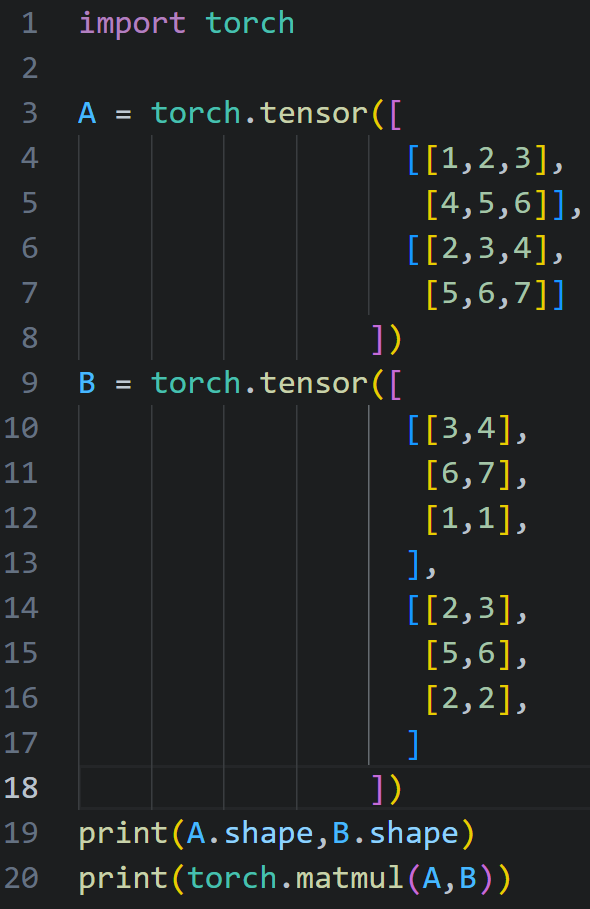
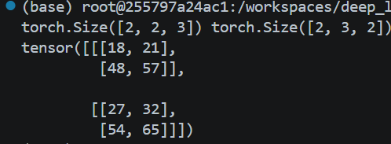

# PyTorch深度学习实战牟大恩译版

## 第一章 深度学习和PyTorch库简介

现如今神经网络存储格式多是`onnx(Open Nerual Networdk eXchange)`，神经网络可以理解成基于数据编程的技术，小编使用docker拉取pytorch的官方image创建container作为运行环境，具体步骤详见网站其余笔记。

## 第二章 预训练网络

神经网络包括架构和参数，不由训练优化、在训练开始时被赋值的变量称为超变量(HyperVariable)，我们可以通过TorchHub等方式直接使用其他人训练好的神经网络和神经网络架构。

## 第三章 从张量开始

张量不同于python中的内置变量，一个张量在内存空间中连续占用存储空间。张量可以通过`torch.tensor`函数，接收可迭代的变量并将其转换为对应维度的张量，以列表为例，`[...]`表示一维张量，`[[],[]...]`表示二维张量，`[[[...]...]...]`表示三维张量。使用函数`torch.zeros`和`torch.ones`，可以根据维度索引创建指定形状的张量，形如`[<dim0,dim1,dim2,...]`，`<dim0>`等值则表明该维度下的最大索引数。

能够使用维度索引创建张量的还有`torch.randn()`等方法，不传入参数时，`randn`方法会生成指定形状的张量并按照正态随机分布填充其中的值。

### 读取张量中的元素

读取一个张量中的数值可以使用维度索引的方式，使用`[<dim0>,<dim1>,..]`的形式表示，`<dim0>`的值表示该维度下的索引值，以矩阵为例，一个`4*5`的矩阵，创建时可以使用维度索引`[4,5]`表示这是一个四行五列的矩阵，此时的索引值更适合称为该维度下的索引数量，读取其中元素时，比如第2行第3列的元素们可以使用`[1,2]`来读取（索引从0开始计，所以是1，2而不是2，3）,张量中也存在反向索引，使用`-1`表示该维度下从后往前数第一个元素。

#### 切片机制

与张量中也存在切片机制，以一维张量为例，使用形如`[index1:index2:step]`的方式可以批量读取张量中的元素，要求`index1`指向的元素必须不靠后于`index2`指向的元素，`step`表示取元素的步长，或者说连续取的两个元素的间隔，默认为1，这将会按步长`step`间隔，读取张量中从`index1`开始，`index2-1`结束范围内的元素，以张量形式返回，`index2`不被包含。

`index1`、`index2`和`step`都可以省略不写，`index1`省略不写表示从第一个元素开始选取元素，`index2`省略不写表示选取范围终止于最后一个元素，但包括最后一个元素，`step`省略不写表示步长为1。特别地`:`表示选取所有元素，`::step`表示从头至尾按步长选取元素。

切片控制式也能够连续应用，之间以逗号`,`间隔，表示是对不同维度应用的，以二维张量`4*4`为例，使用`[:,::2]`表示读取张量所有行中第1,3列的元素。

特别地，使用`...`将默认选择任意维度的索引。在仅使用`...`选择元素时会输出整个张量`a[...]`；`...`在前时表示对从后往前指定维度进行索引选取，其余维度默认选择所有索引，例如`a[...,:2]`表示对最后一个维度应用索引选取，其余维度选择所有索引值；`...`在后则表示对从前往后指定维度应用特设索引选取，其余维度默认选取所有索引值，例如`a[:2,...]`表示对第0个维度应用`:2`，其余维度均选取所有索引值。

### 张量的算术运算

张量的加减乘除运算，都具有逐元素计算的模式，即在参与运算的两个张量`A`,`B`形状相同(若不同，则能够应用广播机制的张量也可参与运算)，结果为`C`，`C`与`A`,`B`或者说广播后的`A`或`B`，形状相同，形状相同值张量维度数相同，各维度的索引数也相同，后续描述时不再强调广播机制。且`C[index0,index1,...] = A[index0,index1,...] (+|-|*|/) B[index0,index1,...]`，即结果张量中对应索引的值由运算张量与其索引相同元素经算术运算得到。仅使用python的算术运算符调用的计算方式为逐元素计算。

除逐元素计算的模式外，乘法还有逐矩阵运算的模式，此时的基本计算单位为数学上的二维矩阵叉乘，要求参与运算的张量`A`，`B`最低二维上的索引数满足矩阵叉乘关系，其余维度索引数相同，左矩阵的列数(列索引数)等于右矩阵的行数(行索引数)，结果张量形状最低二维上的索引数，其中行数等于左张量二维矩阵的行数，列数等于右张量二维矩阵的列数，其余维度索引数与`A`，`B`保持一致，对应索引矩阵的值为运算张量相同索引矩阵叉乘得到的结果。逐矩阵计算不妨举一个实例：

正如下方的运行结果所输出的，`A`的形状为`2*2*3`，`B`的形状为`2*3*2`，最后两个维度对应的二维矩阵行列数符合矩阵叉乘运算规则，数值也有对应索引矩阵叉乘得到，`18 = 1*3 + 2*6 + 3*1...`。

对张量进行逐矩阵乘法运算可以调用函数`torch.matmul()`，其中`mat`即`matrix`矩阵，`mul`即乘法词前缀。

#### 广播机制

广播机制是用于方便用户进行运算的张量拓展机制，可以分为两步，第一步为维度拓展，第二步为索引数拓展。同样举例而言，运算张量`A`的形状为`4*3*2`，`B`的形状为`2`，在运算时`B`先拓展为三维张量`1*1*2`，在填充前两个维度不同索引值对应的一维张量，变成`4*3*2`,前两个维度不管如何搭配索引值，总指向同一个一维张量，显然索引数的扩展由另外一个对应维度索引数更大的张量决定。在拓展维度时，仅将更高维的索引数设为1，不会升高被拓展张量给出的索引数所在的维度，也就是只会往被拓展向量维度索引前方加一，[1,1,2]，而不会向后方加1，[2,1,1]。

### 张量的逻辑运算

张量的逻辑运算采用逐元素计算的方式。特别地，两个相同形状的张量使用`==`逻辑运算符，张量中的每个元素会逐元素地与另一张量对应位置的元素进行比较，结果张量该位置的值会根据比较结果为`True`或`False`。

### 张量处理方法

张量调用方法`mean((dima,dimb,dimc))`，可以按照指定维度计算平均值，`dima,dimab,dimc`为要计算平均值的维度，注意要计算包含多个维度的平均值时要用`()`或`[]`包裹，调用方法返回的张量形状仅保留`dim1,dim2`等维度，其余维度索引数都为1并被压缩删去。

同样地，求和方法与求平均方法作用方式相同，使用`sum()`调用。

调用`unsquezze()`方法每次可以为调用张量增加一个索引总数为1的维度，例如形状为`3*4`的张量`a`，调用一次该方法后，形状变为`1*3*4`。

### 张量元素的数据类型

`Pytorch`的`tensor`对象可以存储`torch.int8`有符号八位整数、`torch.uint8`无符号八位整数、`torch.int16(short)`、`torch.int32(int)`、`torch.int64(long)`、`torch.bool`布尔型、`torch.float16(half)`、`torch.float32(float)`和`torch.float64(double)`。默认数据格式为`float32`，在创建张量时可以使用参数`dtype`指定，形如`A = torch.randn([2,3],dtype = float64)`。

`Pytorch`的`tensor`可以和`Numpy`的数组进行在cpu上进行无空间损耗的转换，`tensor->numpy`可以调用张量的`numpy()`方法，形如`A.numpy()`；`numpy->tensor`可以调用`torch`的`from_numpy`方法，形如`torch.from_numpy(A)`，特别地，`Numpy`默认使用`float64`的存储格式。

使用张量的`to()`方法，可以对张量数据格式进行转换。

### 张量的存储逻辑

实际上我们对一个张量进行的很多操作都不会更改张量的存储结构，只是新建了一个`view`视图，比如读一个张量中的部分元素，对张量进行转置等，不同`view`共享同一内存空间，若其中元素改变，所有`view`都会相应改变。

张量中的元素正如上面所说，按一定顺序在存储空间中连续存储，这是唯一的，除此之外，对该张量的大部分操作都只是新保存一个`view`，包括形状(`shape`)、偏移量(`offset`)和步长(`stride`)。形状即我们前面提到的维度索引，比如一个新建的`2*2`的矩阵，形状为`[2,2]`；偏移量则是当前视图第一个元素与视图对应张量存储空间中第一个元素的差值，一般为自然数，举例来说，新建一个三行两列的张量`A`，取张量A中的前两行赋值给张量`B`，张量`B`形状则为`[2,2]`，`A`和`B`就是对同一张量存储空间的不同`view`，张量`A`和`B`的偏移量都为`0`,再取张量A中的后两行赋值给张量`C`，张量`C`的偏移量则为`2`，因为张量`C`第一个元素距离存储空间中第一个元素间隔为2；`stride`含有与张量维度数相同相同的元素数，用来指示对应维度索引数加一，在存储空间中需要越过的间隔数，以三行二列的新建张量`A`为例，其形状为`[3，2]`，步长则为`[2,1]`，也就是列索引增加一，说明下一元素距当前元素间隔为1，行索引增加一，说明下一元素距当前元素间隔为2。

二维情况下，张量元素的存储方式为从左到右，从上到下，依次排列，将任意维的张量存储为连续的一维序列；更高维的张量则为遍历一张张二维张量，从而将所有元素存储在一维序列中，可以打印张量的`storage()`对象验证这一点，但目前pytorch提示`storage`将会在后续版本中被弃用，推荐使用`untype_storage()`，但`untype_storage()`与`storage()`有了很大改变，有兴趣的读者可以自行了解。

#### 从存储角度理解张量转置

对于张量来说，任意转置两个维度，存储角度来看，转置前后，对应维度的索引数互换，步长也互换。举例来说，设新建张量`A`的形状为`[3,2,4]`，步长为`[8,4,1]`，转置dim0和dim2，则转置后的张量`B`形状为`[4,2,3]`，步长为`[1,4,8]`，两个张量仍然共享同一存储空间。调用方法`transpose(dimx,dimy)`可以对调用张量指定维度进行转置，对二维张量的另一简写方法为`t()`。

#### 张量(view)的contigous属性

由上述内容，我们就能引出对一个`view`是否连续的判断，也就是，如果该视图对应的存储空间并没有按照默认的从左到右，从上到下的顺序排列元素，则称它是不连续的，反之则称它是连续的。调用`is_contiguous`方法可以判断一个`view`是否连续。

新建张量`A`和它的转置张量`B`，`A`是连续的，`B`则是不连续的，因为它没有按照它的形状去排列存储空间中的元素。调用方法`B.contiguous()`可以新建存储空间，并返回重新排列好元素顺序的张量，注意，这不会直接更改`B`指向的存储空间，仍然需要赋值更新`B`应指向的新存储空间，形如`B = B.contiguous()`。通过对比`data_ptr`属性可以验证`A`和连续化后的`B`不再共享存储空间，形如`print(A.data_ptr() == B.data_ptr())`，输出结果为`false`，`ptr`即`pointer`，指针。

设张量`A`的形状为`[2,3,4]`，转置其dim0和dim2得到形状为`[4,3,2]`的张量`B`，此时`B`的步长为`[1,4,12]`，对`B`连续化并更新指针后，`B`的形状为`[4,3,2]`，步长更新为`[6,2,1]`。设`stride_x`为步长中从后向前数（逆序）第x个元素，`dim_x`为逆序第`x`个维度索引总数，则连续张量的步长元素递推式为`stride_x+1 = stride_x * dim_x`，初始项`stride_1 = 1`。

#### 张量的device属性

在张量创建时可以通过`device = `指定张量存储的位置，可以是`cpu`，也可以是`gpu`，特别地，英伟达显卡通过`device = 'cuda<:int>'`的方式指定，若有多张英伟达显卡，将通过`int`来指定显卡序列中的显卡，如果`gpu`使用非`Nvida`，或使用`Google`的`TPU`，请读者自行查询指定方法；对于已经存在的张量，同样可以调用`to(dtype = )`方法来更换张量存储位置，特别地，由存储在`GPU`上的张量经运算或其他操作得到的张量也会存储在`GPU`上；默认张量存储在`CPU`上。

存储在`GPU`上的张量会由`PyTorch`负责并行运算等技术细节，加速神经网络训练。