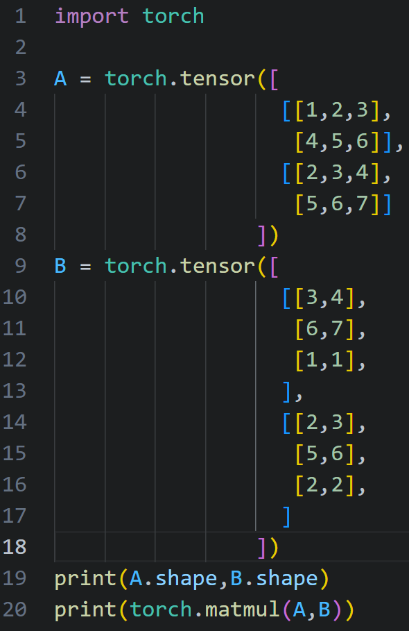
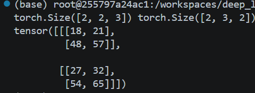

# PyTorch深度学习实战牟大恩译版

## 第一章 深度学习和PyTorch库简介

现如今神经网络存储格式多是`onnx(Open Nerual Networdk eXchange)`，神经网络可以理解成基于数据编程的技术，小编使用docker拉取pytorch的官方image创建container作为运行环境，具体步骤详见网站其余笔记。

## 第二章 预训练网络

神经网络包括架构和参数，不由训练优化、在训练开始时被赋值的变量称为超变量(HyperVariable)，我们可以通过TorchHub等方式直接使用其他人训练好的神经网络和神经网络架构。

## 第三章 从张量开始

张量不同于python中的内置变量，一个张量在内存空间中连续占用存储空间。张量可以通过`torch.tensor`函数，接收可迭代的变量并将其转换为对应维度的张量，以列表为例，`[...]`表示一维张量，`[[],[]...]`表示二维张量，`[[[...]...]...]`表示三维张量。使用函数`torch.zeros`和`torch.ones`，可以根据维度索引创建指定形状的张量，形如`[<dim0,dim1,dim2,...]`，`<dim0>`等值则表明该维度下的最大索引数。

能够使用维度索引创建张量的还有`torch.randn()`等方法，不传入参数时，`randn`方法会生成指定形状的张量并按照正态随机分布填充其中的值。

### 读取张量中的元素

读取一个张量中的数值可以使用维度索引的方式，使用`[<dim0>,<dim1>,..]`的形式表示，`<dim0>`的值表示该维度下的索引值，以矩阵为例，一个`4*5`的矩阵，创建时可以使用维度索引`[4,5]`表示这是一个四行五列的矩阵，此时的索引值更适合称为该维度下的索引数量，读取其中元素时，比如第2行第3列的元素们可以使用`[1,2]`来读取（索引从0开始计，所以是1，2而不是2，3）,张量中也存在反向索引，使用`-1`表示该维度下从后往前数第一个元素。

#### 切片机制

与张量中也存在切片机制，以一维张量为例，使用形如`[index1:index2:step]`的方式可以批量读取张量中的元素，要求`index1`指向的元素必须不靠后于`index2`指向的元素，`step`表示取元素的步长，或者说连续取的两个元素的间隔，默认为1，这将会按步长`step`间隔，读取张量中从`index1`开始，`index2-1`结束范围内的元素，以张量形式返回，`index2`不被包含。

`index1`、`index2`和`step`都可以省略不写，`index1`省略不写表示从第一个元素开始选取元素，`index2`省略不写表示选取范围终止于最后一个元素，但包括最后一个元素，`step`省略不写表示步长为1。特别地`:`表示选取所有元素，`::step`表示从头至尾按步长选取元素。

切片控制式也能够连续应用，之间以逗号`,`间隔，表示是对不同维度应用的，以二维张量`4*4`为例，使用`[:,::2]`表示读取张量所有行中第1,3列的元素。

特别地，使用`...`将默认选择任意维度的索引。在仅使用`...`选择元素时会输出整个张量`a[...]`；`...`在前时表示对从后往前指定维度进行索引选取，其余维度默认选择所有索引，例如`a[...,:2]`表示对最后一个维度应用索引选取，其余维度选择所有索引值；`...`在后则表示对从前往后指定维度应用特设索引选取，其余维度默认选取所有索引值，例如`a[:2,...]`表示对第0个维度应用`:2`，其余维度均选取所有索引值。

### 张量的算术运算

张量的加减乘除运算，都具有逐元素计算的模式，即在参与运算的两个张量`A`,`B`形状相同(若不同，则能够应用广播机制的张量也可参与运算)，结果为`C`，`C`与`A`,`B`或者说广播后的`A`或`B`，形状相同，形状相同值张量维度数相同，各维度的索引数也相同，后续描述时不再强调广播机制。且`C[index0,index1,...] = A[index0,index1,...] (+|-|*|/) B[index0,index1,...]`，即结果张量中对应索引的值由运算张量与其索引相同元素经算术运算得到。仅使用python的算术运算符调用的计算方式为逐元素计算。

除逐元素计算的模式外，乘法还有逐矩阵运算的模式，此时的基本计算单位为数学上的二维矩阵叉乘，要求参与运算的张量`A`，`B`最低二维上的索引数满足矩阵叉乘关系，其余维度索引数相同，左矩阵的列数(列索引数)等于右矩阵的行数(行索引数)，结果张量形状最低二维上的索引数，其中行数等于左张量二维矩阵的行数，列数等于右张量二维矩阵的列数，其余维度索引数与`A`，`B`保持一致，对应索引矩阵的值为运算张量相同索引矩阵叉乘得到的结果。逐矩阵计算不妨举一个实例：

正如下方的运行结果所输出的，`A`的形状为`2*2*3`，`B`的形状为`2*3*2`，最后两个维度对应的二维矩阵行列数符合矩阵叉乘运算规则，数值也有对应索引矩阵叉乘得到，`18 = 1*3 + 2*6 + 3*1...`。

对张量进行逐矩阵乘法运算可以调用函数`torch.matmul()`，其中`mat`即`matrix`矩阵，`mul`即乘法词前缀。

#### 广播机制

广播机制是用于方便用户进行运算的张量拓展机制，可以分为两步，第一步为维度拓展，第二步为索引数拓展。同样举例而言，运算张量`A`的形状为`4*3*2`，`B`的形状为`2`，在运算时`B`先拓展为三维张量`1*1*2`，在填充前两个维度不同索引值对应的一维张量，变成`4*3*2`,前两个维度不管如何搭配索引值，总指向同一个一维张量，显然索引数的扩展由另外一个对应维度索引数更大的张量决定。在拓展维度时，仅将更高维的索引数设为1，不会升高被拓展张量给出的索引数所在的维度，也就是只会往被拓展向量维度索引前方加一，[1,1,2]，而不会向后方加1，[2,1,1]。

### 张量的逻辑运算

张量的逻辑运算采用逐元素计算的方式。逻辑运算符`>`、`<`、`>=`、`<=`、`==`、`!=`都能用于处理相同形状张量的对应逐元素逻辑运算。不同于python中的`&`、`|`、`~`和`^`被用于整型数值逐位运算，torch中可以使用这些符号进行相同形状张量的对应逐元素逻辑运算。逻辑运算后返回的张量元素类型将变为布尔型，每个元素的布尔值由对应索引下参与运算张量的元素和运算符共同决定。

### 张量处理方法

张量调用方法`mean((dima,dimb,dimc))`，可以按照指定维度计算平均值，`dima,dimab,dimc`为要计算平均值的维度，注意要计算包含多个维度的平均值时要用`()`或`[]`包裹，调用方法返回的张量形状仅保留`dim1,dim2`等维度，其余维度被压缩删去。

同样地，求和方法与求平均方法作用方式相同，使用`sum()`调用。使用`sum()`方法计算元素种类为布尔类型的张量时，元素`True = 1`，`False = 0`，得到一个整数形张量，这在进行数据分析时搭配张量的逻辑运算和高级索引会变得非常有用。

调用张量的`item()`方法，可以将只含一个元素的张量转换为对应的python标准数值，比如`tensor = [5]`，则`tensor.item() == 5`。

调用`unsquezze(<index_dim>)`函数每次可以为调用张量增加一个索引总数为1的维度，插入位置由传入的形参`index_dim`确定，例如形状为`3*4`的张量`a`，以`squeeze(a,0)`，形状变为`1*3*4`。

### 张量元素的数据类型

`Pytorch`的`tensor`对象可以存储`torch.int8`有符号八位整数、`torch.uint8`无符号八位整数、`torch.int16(short)`、`torch.int32(int)`、`torch.int64(long)`、`torch.bool`布尔型、`torch.float16(half)`、`torch.float32(float)`和`torch.float64(double)`。默认数据格式为`float32`，在创建张量时可以使用参数`dtype`指定，形如`A = torch.randn([2,3],dtype = float64)`。

`Pytorch`的`tensor`可以和`Numpy`的数组进行在cpu上进行无空间损耗的转换，`tensor->numpy`可以调用张量的`numpy()`方法，形如`A.numpy()`；`numpy->tensor`可以调用`torch`的`from_numpy`方法，形如`torch.from_numpy(A)`，特别地，`Numpy`默认使用`float64`的存储格式。

使用张量的`to()`方法，可以对张量数据格式进行转换。

### 张量的存储逻辑

实际上我们对一个张量进行的很多操作都不会更改张量的存储结构，只是新建了一个`view`视图，比如读一个张量中的部分元素，对张量进行转置等，不同`view`共享同一内存空间，若其中元素改变，所有`view`都会相应改变。

张量中的元素正如上面所说，按一定顺序在存储空间中连续存储，这是唯一的，除此之外，对该张量的大部分操作都只是新保存一个`view`，包括形状(`shape`)、偏移量(`offset`)和步长(`stride`)。形状即我们前面提到的维度索引，比如一个新建的`2*2`的矩阵，形状为`[2,2]`；偏移量则是当前视图第一个元素与视图对应张量存储空间中第一个元素的差值，一般为自然数，举例来说，新建一个三行两列的张量`A`，取张量A中的前两行赋值给张量`B`，张量`B`形状则为`[2,2]`，`A`和`B`就是对同一张量存储空间的不同`view`，张量`A`和`B`的偏移量都为`0`,再取张量A中的后两行赋值给张量`C`，张量`C`的偏移量则为`2`，因为张量`C`第一个元素距离存储空间中第一个元素间隔为2；`stride`含有与张量维度数相同相同的元素数，用来指示对应维度索引数加一，在存储空间中需要越过的间隔数，以三行二列的新建张量`A`为例，其形状为`[3，2]`，步长则为`[2,1]`，也就是列索引增加一，说明下一元素距当前元素间隔为1，行索引增加一，说明下一元素距当前元素间隔为2。

二维情况下，张量元素的存储方式为从左到右，从上到下，依次排列，将任意维的张量存储为连续的一维序列；更高维的张量则为遍历一张张二维张量，从而将所有元素存储在一维序列中，可以打印张量的`storage()`对象验证这一点，但目前pytorch提示`storage`将会在后续版本中被弃用，推荐使用`untype_storage()`，但`untype_storage()`与`storage()`有了很大改变，有兴趣的读者可以自行了解。

#### 从存储角度理解张量转置

对于张量来说，任意转置两个维度，存储角度来看，转置前后，对应维度的索引数互换，步长也互换。举例来说，设新建张量`A`的形状为`[3,2,4]`，步长为`[8,4,1]`，转置dim0和dim2，则转置后的张量`B`形状为`[4,2,3]`，步长为`[1,4,8]`，两个张量仍然共享同一存储空间。调用方法`transpose(dimx,dimy)`可以对调用张量指定维度进行转置，对二维张量的另一简写方法为`t()`。

#### 张量(view)的contigous属性

由上述内容，我们就能引出对一个`view`是否连续的判断，也就是，如果该视图对应的存储空间并没有按照默认的从左到右，从上到下的顺序排列元素，则称它是不连续的，反之则称它是连续的。调用`is_contiguous`方法可以判断一个`view`是否连续。

新建张量`A`和它的转置张量`B`，`A`是连续的，`B`则是不连续的，因为它没有按照它的形状去排列存储空间中的元素。调用方法`B.contiguous()`可以新建存储空间，并返回重新排列好元素顺序的张量，注意，这不会直接更改`B`指向的存储空间，仍然需要赋值更新`B`应指向的新存储空间，形如`B = B.contiguous()`。通过对比`data_ptr`属性可以验证`A`和连续化后的`B`不再共享存储空间，形如`print(A.data_ptr() == B.data_ptr())`，输出结果为`false`，`ptr`即`pointer`，指针。

设张量`A`的形状为`[2,3,4]`，转置其dim0和dim2得到形状为`[4,3,2]`的张量`B`，此时`B`的步长为`[1,4,12]`，对`B`连续化并更新指针后，`B`的形状为`[4,3,2]`，步长更新为`[6,2,1]`。设`stride_x`为步长中从后向前数（逆序）第x个元素，`dim_x`为逆序第`x`个维度索引总数，则连续张量的步长元素递推式为`stride_x+1 = stride_x * dim_x`，初始项`stride_1 = 1`。

#### clone方法

使用`clone`方法可以在其他存储空间创建一个调用该方法张量的副本，调用形式形如`tensor.clone()`。

#### 张量的device属性

在张量创建时可以通过`device = `指定张量存储的位置，可以是`cpu`，也可以是`gpu`，特别地，英伟达显卡通过`device = 'cuda<:int>'`的方式指定，若有多张英伟达显卡，将通过`int`来指定显卡序列中的显卡，如果`gpu`使用非`Nvida`，或使用`Google`的`TPU`，请读者自行查询指定方法；对于已经存在的张量，同样可以调用`to(dtype = )`方法来更换张量存储位置，特别地，由存储在`GPU`上的张量经运算或其他操作得到的张量也会存储在`GPU`上；默认张量存储在`CPU`上。

存储在`GPU`上的张量会由`PyTorch`负责并行运算等技术细节，加速神经网络训练。

## 第四章 使用张量表征真实数据

### 表征图片

#### imageio库

使用`import imageio`导入该库后，可以以`imageio.imread（<path_to_im>）`的形式调用读取图片的函数，在参数中传入图片路径指定被导入图片，图片被导入后，一般是一个三维类Numpy数组，维度依次是高度、宽度和通道数，使用函数`torch.form_numpy(<numpy_object>)`可以将该数组转换为张量。

使用Pytorch张量的`tensor.permute(index1,index2...)`方法可以调换维度顺序，形参中的`index1,index2`是预期的新维度排列顺序，值为原维度从左到右以零起记的索引。`tensor.permute(-1,0,1)`，会将张量`tensor`的第三个维度调至第一个维度，第一个维度和第二个维度后移至第二个和第三个维度。特别地，调换前后的张量仍然共享同一存储空间。

因为涉及`io`操作，我们还需要补充一些`os`库和原生库中的函数和方法。

#### 一些io操作

使用`import os`导入`os`库，以`os.listdir(<path_dir>)`调用函数将会以可迭代对象的方式返回形参`path_dir`下的所有文件名（字符串），搭配`for`和`next`等可以逐个遍历其中的元素。使用`os.path.splitext(<String>)`可以拆分文件名(字符串)，得到路径名和拓展名，路径名在前，拓展名在后，同样是一个可迭代对象，一般使用`os.path.splitext(<String>)[-1]`的形式读取文件名中的后缀名以区分文件类型。

使用`os.path.join(<str_path1>,<str_path2>....)`可以拼接路径，一般从左至右拼接，若其中存在绝对路径(以斜杠或反斜杠始的路径)，则从最后一个绝对路径处开始拼接，若最后传入的路径是一个空字符串，则在拼接路径最后添加斜杠或反斜杠。

使用内置库中的`enumerate(<iterable_obj>)`函数可以将传入的可迭代对象中的每个元素转换为包含原元素和该元素索引，并同样返回可迭代对象，索引从左至右以零起记，比如一个列表`list = [3,4,5]`，将其传入`enumerate(list)`中，得到`[[0,3],[1,4],[2,5]]`，索引在前，原元素在后。

使用内置库中的`zip(<iterable_odj1,iterable_odj2,..)`函数可以将传入的可迭代对象按传入顺序逐元素地打包成一个元组作为返回列表的一个元素，当不同的可迭代对象元素数不同时，返回列表的元素数为所有传入对象元素数的最小值。在python3.0版本更新后，`zip`返回列表对象的索引，需要使用`list()`显式转换进行读取。例如，`list1 = [1,2,3,4],list2 = [5,6,7,8]`，则`list(zip(list1,list2)) = [(1,5),(2,6),(3,7),(4,8)]`。在形参中可以直接使用`*`对列表对象进行操作，无需显式转换，例如`zip(*zip(list1,list2))`。

### 数据正规化

神经网络在处理`-1~1`或`0~1`的输入数据时，往往表现更佳，将输入数据映射到这个范围，称为数据归一化，在这里介绍两种方法。

第一种是将数据都除以该存储类型下的最大数字，比如8位无符号整数能表示的最大值是255，而一般图片中每个通道下的单个像素像素值都以8位无符号整数存储，因此，图片中每个通道中的每个像素值都会被映射到`0~1`的范围。

第二种方法是将数据分布转换为标准正态分布(均值为0，标准差为1)，具体转换方式为求出输入数据的均值和标准差，将所有输入数据都减去均值并除以标准差，运算后相当部分的数据都会落在`-1~1`区间，数学原理参见概率论与数理统计相关内容。

### 表征表格

表格在去除表头后，是一个二维张量，每行是一条记录，每列包含所有记录在该表头下的值。

使用numpy库中的`loadtxt(<path_txt>,[delimiter = ''],[skiprows = ],[dtype = ])`可以方便地读取简单的数据文件，比如`csv`，并返回numpy数组，`path_txt`表示文件名，`delimiter`表示分割元素的符号，比如`,`或`;`，`skiprows`表示不进行转化的行数，按从上到下的顺序从`1`始记，`dtype`表示转换后的numpy数组中数据的存储格式，其与torch的表示方式基本一致，有`numpy.float32,numpy.float64,numpy.int8`等，其余请参考前述内容，此处`numpy`可以使用在导入库文件时的别名，如果在导入时使用`import numpy as np`，此处就可以写作`np.float32`等等。

调用`numpy.loadtxt()`函数后，一般返回一个二维Numpy数组，传入的分隔符区分同一行中的不同列元素，换行符区分不同行的元素。使用`torch.from_numpy()`将Numpy数组转换为张量。

### 独热编码

作为模型训练依赖的标签，在进行分类任务时，若不同结果之间并无顺序和距离联系，则分类结果建议使用独热(One-hot)编码表示，独热编码中的`hot`表示的是激活的含义，源于早期的数字电路等硬件领域，独热即仅有一个激活，其余都不激活。

若分类结果有`n`中，则独热编码也有`n`位，每位固定代表一种分类结果，作为标签时，标签值对应的那一位二进制为`1`，其余全部为`0`，以猫狗分类任务为例，第一位二进制表示是否为猫，第二位二进制表示是否为狗，若一张训练图片是猫的图片，则其标签的独热编码为`10`，反之，一张狗的图片，其标签独热编码为`01`。

#### scatter方法和gather函数

scatter方法通过`tensor.scatter(<dim>,<index_tensor>,<fill_tensor>)`的形式调用，`<dim>`为要被索引张量中的值替换的维度，`index_tensor`为提供被替换索引值的张量，`fill_tensor`为提供填充值的张量，要求`tensor`、`index_tensor`和`fill_tensor`的维数相同，且任一维度索引数，`fill_tensor`和`tensor`都要不小于`index_tensor`，若`fill_tensor`可广播，则会将`fill_tensor`通过广播机制填充为与`index_tensor`相同形状，`index_tensor`的元素类型必须为`int64`，且其中的元素值不能超过`tensor`维度数方向上的索引最大值。

假设全为二维张量，`index_tensor`中的元素`[x,y]`值为`a`，若维度数选择`0`，则`tensor[a,y] = fill_tensor[x,y]`，反之维度数选择`1`，则`tensor[x,a] = fill_tensor[x,y]`，形象上来说，将`tensor`和`fill_tensor`两个张量沿左上角对齐，`fill_tensor`中的元素根据相同索引的`index_tensor`中的元素值，进行横向(维度数为1)或纵向移动(维度数为0)，结果张量取`index_tensor`与`tensor`的重叠部分移动后的结果和`tensor`的剩余部分的并集。

举一实例，设`tensor`为5*5的零矩阵，`index_tensor`为每列元素都等于其列索引的5\*5矩阵，也就是`index_tensor[:,i] = i`，`fill_tensor`为每行元素都等于其行索引的5\*5矩阵，也就是`fill_tensor[i,:] = i`，使用`tensor.scatter_(1,index_tensor,fill_tensor)`调用`scatter`方法，则结果矩阵与`fill_tensor`完全一致，如下图所示。

gather函数则是通过`index_tensor`选取`tensor`中的元素组成新矩阵并作为结果返回，假设`index_tensor`和`tensor`都为5*5的张量，通过`gather(tensor,<dim>,index_tensor)`的形式调用`ganther`方法，返回张量`result`，若`dim = 1`，则`result[i,j] = tensor[i,index[i,j]]`，反之`dim = 0`，则`result[i,j] = tensor[index[i,j],j]`。

前面我们曾介绍张量的`mean()`方法，在此我们介绍`var(<tensor>,[dim])`函数，`tensor`为要进行求标准差操作的张量，`[dim]`为要求标准差的维度。特别地，不用记忆torch库中的处理是通过方法还是函数的调用，像求均值和求标准差的运算，既可以通过`torch.mean(),torch.var()`调用，也可以通过张量`tensor`的`tensor.mean(),tensor.var()`调用，使用区别仅在于是否有调用张量并传入它。

#### 张量的高级索引

张量索引除切片索引外，我们还可以通过类型为布尔值的可迭代对象读取张量中的元素。设`tensor = torch.randn([5,5])`，`label_bool = [True,False,True,False,True]`，则`tensor[lable_bool]`将取二维张量中第1，3，5行的元素。当`lable_bool`为一维可迭代对象时，优先从维度索引更小的维度判断选取，比如上面的例子中，`label_bool`显然对应的是第零维度的索引选取情况，且`label_bool`中的元素要与选取维度下的索引总数一一对应，第零维有`0,1,2,3,4`五个索引值，`label_bool`同样有五个布尔值元素。若布尔型可迭代对象不止一维，则仍然按照维度索引从低到高的顺序判断选取的维度。

## 表征时间序列数据

### converters批量处理列数据

我们有时需要对`numpy.loadtxt()`的导入数据中特定几列进行处理，我们可以使用`loadtxt()`中的`converters`参数进行批量处理。

`converters`参数要求传入一个字典，字典的键名为从零记的列索引，键值为一个函数，一般使用`lambda`匿名函数。举例而言，我想要对二维numpy数组中的第一列整体加一，第三列整体乘二，则我可以定义`converters = {1: lambda x: x + 1,3: lambda x: x*2}`，并在调用`loadtxt()`时将其传入，即`numpy.loadtxt(...,converters = converters)`。