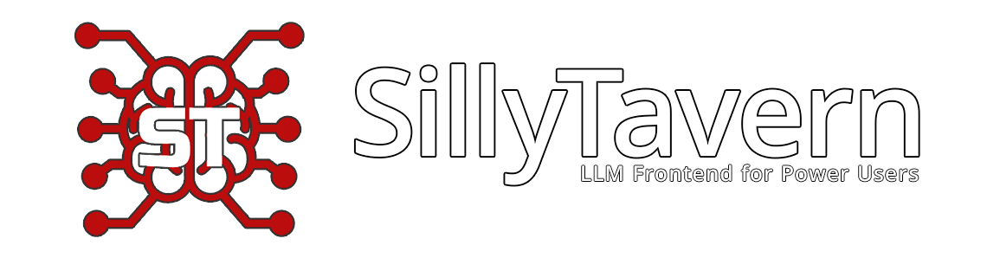

# What is SillyTavern?

SillyTavern(简称ST)是一个本地配置的用户界面，允许您能够与文本生成式大语言模型、图生成引擎和TTS语音模型进行交互。我们的目标是使用户尽可能充分地利用大语言模型的提示词来发挥其能力，将陡峭的学习曲线看作乐趣的一部分。

SillyTavern是一个由大语言模型忠实爱好者社区发起的为您带来激情的项目，将保持开源与免费。项目开始于2023年2月作为TavernAI 1.2.8版本的fork，但SilliyTavern现在已经拥有超过300名贡献者和3年独立发展，并且将持续为有一定经验的AI爱好者作为引导性的软件服务。

## 安装环境

本项目的硬件需求很小：只要您的设备能够运行20版本及以上的NodeJS就能满足。如果您打算在本地运行大语言模型，我们建议配备至少为英伟达3000系及以上显卡，且拥有至少6GB的VRAM。

请按照平台点击安装引导
* Windows
* Linux and Mac
* Android
* Docker

## 分支

SillyTavern目前使用两条分支进行开发，来确保所有用户的顺滑体验。
* release-建议大多数用户安装。这是最稳定和最推荐的分支，仅有重要发布时才会推送版本更新。它适合大多数用户，一般每个月进行一次更新。
* staging-不推荐缺乏经验的用户使用。这条分支会拥有最新的一些功能，但它随时可能出现问题。仅推荐具有相关知识的用户和爱好者使用。一般每天更新数次。

## 除了SillyTavern我还需要哪些准备？

SillyTavern仅仅是一个用户界面，您还需要提供访问一个大模型的接口。你可以使用AI Horde（一个提供分布式计算的公益开源项目）来获得开箱即用的即时体验。除此之外，我们还支持许多其他本地或云端的大语言模型后端:OpenAI-compatible API,KoboldAI,Tabby等，你可以阅读“API连接”一节获取更多有关受支持API的信息。

## 角色卡

SillyTavern项目围绕“角色卡”的概念开展。一张角色卡包含了一组提示词，用于设定大语言模型的行为，并确保稳定的交流体验。它的作用方式类似于ChatGPT的GPTs或者Poe的bots。这张角色卡可以是以下任意内容：一个简要的剧情梗概，一个特定任务下的定制助手，一种受欢迎的性格或者一个虚构人物。

如果您想要不选择角色卡，仅仅为了测试与大模型的连接，打开SillyTavern后，您可以简要输入您的提示词到欢迎页的提示框中。这将会创建一个空的“助手”角色卡，您可以稍后再进行角色卡的配置。

如果您只有一个有关角色卡大致的想法，您可以查看默认角色（Seraphina）或从“Download Extensions&Assets”菜单中下载由社区制作的角色卡。

你也可以从头开始创建自己的角色卡，参见"角色卡设计引导"获取更多信息。

## 项目特色

* 社区制作的大量文本生成高级设置预设
* 语料支持：选择是否为您的角色卡提供大量知识
* 组对话：与您或其他人聊天的多角色卡房间
* 丰富的用户界面自定义选项：主题颜色，背景图片，自定义的CSS等等
* 提供RAG（检索增强生成）支持：您可以为您的聊天机器人提供参考文档
* 拓展聊天指令子系统和自有脚本引擎

## 拓展

SillyTavern具有以下拓展支持：
* 角色情绪化表达（变得更古灵精怪）
* 聊天历史自动总结
* 智能用户界面和聊天翻译
* 稳定的Diffusion/FLUX/DALL-E图像生成
* AI回复的文字转语音
* 通过网页检索向您的提示词中加入来自真实世界的上下文
* 更多可从“Download Extensions&Assets”菜单下载的拓展

## 我该如何直接和开发者联系？
* Discord：cohee，rossascends，wolfsblvt
* Reddit：/u/RossAscends，/u/sillylossy，u/Wolfsblvt
* 提交Github issue

## 我喜欢你们的项目，我该如何为项目做出贡献？
* 我们欢迎在Github上提交PR！请按照文档Contribution引导了解更多。
* 我们也欢迎有信息量和帮助的漏洞报告，请使用我们Github上提供的模板进行报告。
* 我们不因为项目接受金钱捐助。

## 个人捐献
您对个人贡献者进行支持是合适的，但捐献不会影响SillyTavern的整体开发方向。
* 对RossAscends个人的Patreon&Kofi

## 版权

SillyTavern是一个免费开源项目，遵循AGPL-3.0开源协议。